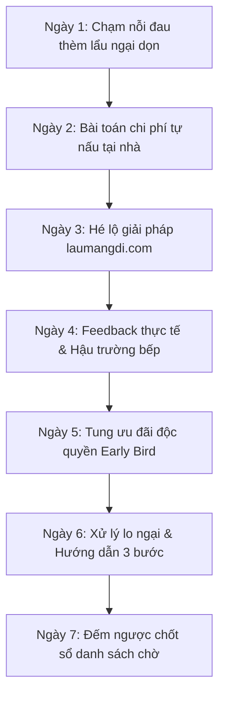

# 🍲 KẾ HOẠCH CONTENT 7 NGÀY KÉO WAITLIST CHO LAUMANGDI.COM
*(Phiên bản Tối ưu nguồn lực: Tập trung Bài viết Text + Ảnh thực tế, Threads, Story & Reel siêu ngắn 10-15s)*

> **Mục tiêu:** Kéo người dùng đăng ký vào danh sách chờ (Waitlist / Form khảo sát nhu cầu) chuẩn bị ra mắt dịch vụ **laumangdi.com** (Lẩu Mang Đi – Tiện Lợi, Chuẩn Vị, Ăn Mọi Nơi).  
> **Link Form khảo sát / Danh sách chờ:** `https://www.laumangdi.com/#survey-section`  
> **Định dạng ưu tiên (Lean & Fast):** Không tốn thời gian dựng video phức tạp. 80% là bài viết Text kèm 1 ảnh chụp điện thoại chân thực, bài đăng Threads/Group cộng đồng, Story thăm dò ý kiến và Reel ngắn 10-15s quay 1 chạm (single-take).  
> **Brand Voice áp dụng (từ `brain.db`):** Thực chiến & gần gũi, câu ngắn nhịp nhanh, mở đầu bằng tình huống thực tế, dùng số liệu đòn bẩy, xưng hô thân mật như nói chuyện với bạn bè, dùng các cụm quen thuộc (*"thật ra", "đơn giản thôi", "thử xem", "không cần phức tạp"*).

---

## 🎯 TỔNG QUAN PHỄU CHUYỂN ĐỔI 7 NGÀY

---

## 📅 CHI TIẾT KẾ HOẠCH 7 NGÀY (3 BÀI / NGÀY)

---

### 🗓 NGÀY 1: CHẠM ĐÚNG "NỖI ĐAU" – THÈM LẨU NHƯNG NGẠI DỌN

*Mục tiêu:* Gợi nhắc cảm giác thèm ăn lẩu nhưng ngán ngẩm khâu chuẩn bị, dọn dẹp hoặc chen chúc ngoài quán.

#### 📌 Bài 1 (Sáng: 08:30 - 09:30)
- **Kênh đăng:** Facebook Cá nhân / Fanpage
- **Định dạng:** Bài viết Text + 1 ảnh chụp đống bát đĩa / nồi lẩu sau bữa ăn.
- **Tone bài:** Tâm sự gần gũi, kể chuyện đời thường, câu ngắn, thẳng thắn.
- **Tiêu đề / Hook:** *"Thèm lẩu lúc 8 giờ tối và cái kết dọn bếp đến nửa đêm..."*
- **Nội dung chính:**
  - Kể chuyện tối qua đi làm về muộn thèm nồi lẩu. Ra quán thì đông đúc chen chúc, tự đi chợ mua thì rau một mớ thịt một khay ăn không hết, rửa nồi ngập bồn.
  - Insight: *"Thật ra, chúng ta chỉ muốn một bữa lẩu ngon, mở nắp là sôi, ăn xong không phải đánh vật với đống bát đĩa."*
- **CTA:** *"Đang ấp ủ một giải pháp giải quyết đúng nỗi ám ảnh này. Bạn thường thèm vị lẩu nào nhất lúc tan làm? Điền form nhanh 30s góp ý giúp mình nhé: [Link Form]"*

---

#### 📌 Bài 2 (Trưa: 11:45 - 12:30)
- **Kênh đăng:** Group Cư Dân Chung Cư / Hội Dân Văn Phòng
- **Định dạng:** Bài thảo luận ngắn gọn (Text only hoặc ảnh meme nhẹ nhàng).
- **Tone bài:** Thực tế, gợi mở thảo luận, bình dân.
- **Tiêu đề / Hook:** *"Trưa nay ăn gì? Nghịch lý 30 phút lướt app giao đồ ăn."*
- **Nội dung chính:**
  - Nhắc lại cảnh nhóm 4-5 người giờ trưa muốn ăn gì đó nóng hổi, xôm tụ như lẩu nhưng không có bếp nấu, app ship thì nguội ngắt.
  - Thăm dò: *"Nếu có set lẩu mang đi phục vụ tận bàn làm việc kèm đầy đủ bếp, nước dùng sôi sùng sục trong 15 phút, mọi người có ủng hộ không?"*
- **CTA:** *"Tụi mình sắp ra mắt `laumangdi.com`. Điền form khảo sát 1 phút để nhận voucher 50k ngày mở bán nhé: [Link Form]"*

---

#### 📌 Bài 3 (Tối: 20:00 - 21:00)
- **Kênh đăng:** Facebook/Instagram Story (Widget bình chọn) + Threads
- **Định dạng:** Story 1 tấm ảnh chụp nồi lẩu + Sticker bình chọn / Bài Threads ngắn 3 dòng.
- **Tone bài:** Tương tác nhanh, hỏi thẳng.
- **Nội dung:**
  - Story: Ảnh nồi lẩu sôi + câu hỏi: *"Ăn lẩu tại nhà bạn sợ nhất khâu nào? 👉 [Rửa nồi béo ngậy] vs [Đi chợ sơ chế]"*.
  - Threads: *"1 sự thật: Người thích ăn lẩu nhiều nhất chính là người lười rửa bát nhất. Đúng không cả nhà? :)"*
- **CTA:** Chèn link Form trực tiếp vào Story/Comment Threads để nhận vé trải nghiệm sớm.

---

### 🗓 NGÀY 2: BÓC TRẦN NGHỊCH LÝ – BÀI TOÁN CHI PHÍ TỰ NẤU

*Mục tiêu:* Đưa ra số liệu thực tế chứng minh tự đi chợ nấu lẩu lẻ vừa đắt vừa mệt so với set đóng gói tiện lợi.

#### 📌 Bài 1 (Sáng: 08:30 - 09:30)
- **Kênh đăng:** Facebook Cá nhân / Fanpage
- **Định dạng:** Bài viết Text dài vừa phải (Storytelling có số liệu) + 1 ảnh chụp hóa đơn đi chợ.
- **Tone bài:** Khách quan, sắc bén, dùng số liệu đòn bẩy.
- **Tiêu đề / Hook:** *"Làm một phép tính nhỏ: 1 bữa lẩu tự nấu tốn của bạn bao nhiêu?"*
- **Nội dung chính:**
  - Liệt kê chi phí thực tế:
    - Mua thịt bò, nấm, rau, gia vị lẻ: 450.000đ (thừa bỏ tủ lạnh hư 30%).
    - Thời gian đi lại, rửa rau, sơ chế, rửa nồi: 2.5 tiếng.
    - Quy đổi 1 giờ công làm việc = Bạn tốn hơn 700k cho một bữa lẩu tại gia.
  - Insight: *"Đơn giản thôi, bạn không thiếu tiền, bạn chỉ thiếu một set đồ ăn đóng gói vừa vặn."*
- **CTA:** *"Điền form khảo sát để giúp tụi mình ra mắt combo lẩu đúng khẩu vị và tiết kiệm nhất cho bạn: [Link Form]"*

---

#### 📌 Bài 2 (Trưa: 12:00 - 13:00)
- **Kênh đăng:** Group Review Đồ Ăn / Ẩm Thực Địa Phương
- **Định dạng:** Bài post kèm 2-3 ảnh chụp các vị nước lẩu (Thái tomyum, Nấm dưỡng sinh, Riêu cua).
- **Tone bài:** Thảo luận cộng đồng, gần gũi.
- **Tiêu đề / Hook:** *"Team lẩu Thái chua cay hay team lẩu nấm thanh ngọt? Vị nào khó nấu chuẩn nhất tại nhà?"*
- **Nội dung chính:**
  - Khơi gợi tranh luận về công thức nước lẩu chuẩn vị quán.
  - Hé lộ: Bếp đang chuẩn bị ra mắt dòng nước cốt hầm xương 12 tiếng đóng chai tiệt trùng.
- **CTA:** *"Vote vị bạn thích qua form ngắn này, tụi mình tặng bạn phần nước dùng miễn phí ngày mở bán: [Link Form]"*

---

#### 📌 Bài 3 (Tối: 20:30 - 21:30)
- **Kênh đăng:** Facebook / Instagram Reel ngắn (10-15s quay 1 shot)
- **Định dạng:** Quay 1 cú máy camera lia từ đống rau thịt mua thừa trong tủ lạnh -> lia sang dòng text trên màn hình. Không cần dựng.
- **Tone bài:** Thật thà, trực quan.
- **Caption Reel:** *"Tự đi chợ nấu lẩu cho 2 người và cái kết ăn đồ thừa 3 ngày sau... Sắp có giải pháp cứu cánh rồi cả nhà ơi! Đăng ký waitlist nhận thông báo sớm tại link Bio nha."*
- **CTA:** Link form ở Bio / Link đính kèm.

---

### 🗓 NGÀY 3: HÉ LỘ GIẢI PHÁP – LAUMANGDI.COM CÓ GÌ KHÁC BIỆT?

*Mục tiêu:* Chính thức hé lộ tên thương hiệu `laumangdi.com` cùng định vị độc đáo: Hộp lẩu trọn gói – mở ra là sôi, không cần rửa bát.

#### 📌 Bài 1 (Sáng: 09:00 - 10:00)
- **Kênh đăng:** Facebook Cá nhân & Fanpage
- **Định dạng:** Bài viết Text giới thiệu sản phẩm + Ảnh chụp bao bì/khay lẩu mẫu thực tế.
- **Tone bài:** Tự tin, thẳng thắn, giải thích chi tiết, không làm màu.
- **Tiêu đề / Hook:** *"Chúng tôi không bán đồ ăn sẵn. Chúng tôi bán 2 tiếng thảnh thơi sau giờ làm."*
- **Nội dung chính:**
  - Giới thiệu `laumangdi.com`:
    1. Khay chia ngăn giữ thịt tươi và rau giòn chuẩn lạnh.
    2. Nước cốt cô đặc hầm xương thật, chỉ cần thêm nước sôi trong 3 phút.
    3. Tùy chọn kèm khay nhôm và bếp cồn mini – ăn xong túm lại vứt thùng rác.
  - Tuyên bố: *"Không chuẩn bị. Không dọn dẹp. Mở ra là ăn."*
- **CTA:** *"Danh sách chờ đợt 1 chỉ nhận 100 người. Bấm link form để giữ suất quà tặng mở bán: [Link Form]"*

---

#### 📌 Bài 2 (Trưa: 12:00 - 13:00)
- **Kênh đăng:** Group Cắm Trại / Camping & Picnic / Phượt
- **Định dạng:** Bài viết chia sẻ kinh nghiệm + 1 ảnh set lẩu đặt trên bàn camping ngoài trời.
- **Tone bài:** Dân dã ngoại, tiện lợi, thực chiến.
- **Tiêu đề / Hook:** *"Đi camping muốn ăn lẩu xịn giữa rừng mà không muốn vác theo cả căn bếp?"*
- **Nội dung chính:**
  - Chia sẻ giải pháp lẩu mang đi đóng gói gọn nhẹ trong túi giữ nhiệt, sẵn bếp cồn và nồi nhôm nhẹ tênh cho các chuyến đi chơi cuối tuần.
- **CTA:** *"Anh em hay đi camp điền form này nhận set dùng thử đợt đầu nhé: [Link Form]"*

---

#### 📌 Bài 3 (Tối: 20:00 - 21:00)
- **Kênh đăng:** Threads / Facebook Story
- **Định dạng:** Text ngắn trên Threads / Ảnh Story chụp cận cảnh đĩa thịt bò tươi.
- **Tone bài:** Hóm hỉnh, khơi gợi tò mò.
- **Nội dung:** *"Đố bạn: Điều gì tuyệt vời hơn một bữa lẩu ngon vào tối mát trời? 👉 Là ăn xong đứng dậy đi ngủ luôn, không phải rửa cái nồi nào cả :) Chi tiết tại laumangdi.com"*
- **CTA:** Gắn link form đăng ký.

---

### 🗓 NGÀY 4: HẬU TRƯỜNG THỬ NGHIỆM (BEHIND THE SCENES) & FEEDBACK

*Mục tiêu:* Tăng độ tin cậy bằng hình ảnh thật lúc test món và phản hồi của những người ăn thử đầu tiên.

#### 📌 Bài 1 (Sáng: 08:30 - 09:30)
- **Kênh đăng:** Facebook Cá nhân / Fanpage
- **Định dạng:** Bài viết Text kể chuyện hậu trường + 2 ảnh chụp bếp đang thử nghiệm nước dùng.
- **Tone bài:** Minh bạch, chân thành, câu chuyện thực tế.
- **Tiêu đề / Hook:** *"Thử nghiệm 20 lần nước lẩu chỉ để chọn ra đúng 2 vị xuất sắc nhất."*
- **Nội dung chính:**
  - Kể chuyện đội ngũ tự nấu, tự nếm và đổ đi làm lại nhiều lần.
  - Bài học: *"Khách hàng không cần một menu 20 món bình thường, họ chỉ cần 2-3 vị thực sự đậm đà, chuẩn vị như ngoài quán."*
  - Công bố 2 vị lẩu hoàn thiện: Thái chua cay chuẩn vị và Lẩu Nấm thảo mộc.
- **CTA:** *"Bạn muốn thử vị nào trước? Đăng ký ngay trong form khảo sát để tụi mình chuẩn bị: [Link Form]"*

---

#### 📌 Bài 2 (Trưa: 12:00 - 13:00)
- **Kênh đăng:** Group Dân Công Sở / Hội Review Ăn Uống
- **Định dạng:** Bài chia sẻ kèm 1 ảnh chụp bàn làm việc đang ăn lẩu.
- **Tone bài:** Người thật việc thật, khách quan.
- **Tiêu đề / Hook:** *"Đem set lẩu mang đi cho đồng nghiệp ăn thử trưa nay và phản hồi bất ngờ..."*
- **Nội dung chính:**
  - Kể ngắn gọn trải nghiệm: 4 người ăn no nê trong 30 phút nghỉ trưa, nước sôi tại bàn, ăn xong 2 phút dọn sạch bách, không bám mùi văn phòng.
- **CTA:** *"Team công ty bạn có muốn nhận set ăn thử đợt tới không? Đăng ký tại form này nha: [Link Form]"*

---

#### 📌 Bài 3 (Tối: 20:00 - 21:00)
- **Kênh đăng:** Reel/Story ngắn 10s
- **Định dạng:** Video 10 giây quay cận cảnh nước lẩu đang sôi sùng sục, nhúng đũa thịt bò (không cần chỉnh sửa cầu kỳ, chỉ cần âm thanh xì xèo chân thực).
- **Caption Reel/Story:** *"Tối mát trời như này mà có nồi lẩu sôi ngay trước mặt thì còn gì bằng... Đăng ký danh sách chờ tại link Bio nhận ưu đãi 40% ngày mở bán nhé!"*
- **CTA:** Link form ở Bio / Story Link.

---

### 🗓 NGÀY 5: TUNG ƯU ĐÃI ĐỘC QUYỀN CHO WAITLIST (EARLY BIRD)

*Mục tiêu:* Đẩy cao tỷ lệ chuyển đổi vào form bằng quyền lợi tài chính rõ ràng, tạo hiệu ứng FOMO (sợ lỡ mất).

#### 📌 Bài 1 (Sáng: 09:00 - 10:00)
- **Kênh đăng:** Facebook Fanpage / Cá nhân
- **Định dạng:** Bài viết công bố ưu đãi + 1 ảnh đồ họa đơn giản (hoặc ảnh chụp đĩa bò kèm chữ 'Tặng 40%').
- **Tone bài:** Hào hứng, dứt khoát, quyền lợi rõ ràng.
- **Tiêu đề / Hook:** *"Dành riêng cho 100 người đầu tiên: Voucher giảm 40% + Tặng thêm 1 khay bò Mỹ!"*
- **Nội dung chính:**
  - Công bố chính sách độc quyền cho người trong Danh sách chờ:
    1. Giảm 40% đơn hàng đầu tiên khi website chính thức mở bán.
    2. Tặng kèm 1 khay ba chỉ bò Mỹ cuộn tươi.
    3. Ưu tiên giao hàng trong khung giờ cao điểm.
  - Nhấn mạnh: *"Chỉ áp dụng cho những ai đã điền form trước ngày ra mắt."*
- **CTA:** *"Điền form ngay – mất đúng 45 giây để nhận trọn bộ quà tặng: [Link Form]"*

---

#### 📌 Bài 2 (Trưa: 11:30 - 12:30)
- **Kênh đăng:** Threads / Zalo Cá nhân
- **Định dạng:** Text ngắn cập nhật tiến độ (Progress update).
- **Tone bài:** Gần gũi, khẩn trương nhẹ.
- **Nội dung:**
  - *"Cập nhật: Form danh sách chờ mở sáng nay đã có 68/100 bạn đăng ký rồi. Còn đúng 32 suất cuối nhận voucher giảm 40% và khay bò tặng kèm. Ai chưa kịp điền thì tranh thủ nha!"*
- **CTA:** Link form trực tiếp.

---

#### 📌 Bài 3 (Tối: 20:30 - 21:30)
- **Kênh đăng:** Facebook Story / Instagram Story
- **Định dạng:** Ảnh chụp màn hình tin nhắn bạn bè/khách hỏi đặt lẩu + Dòng chữ đếm ngược số suất còn lại.
- **Tone bài:** Thân thiện, nhắc nhở.
- **CTA:** Kèm Link Sticker dẫn thẳng vào Google Form.

---

### 🗓 NGÀY 6: XỬ LÝ LO NGẠI & HƯỚNG DẪN 3 BƯỚC ĂN LẨU TIỆN LỢI

*Mục tiêu:* Đập tan các rào cản về việc ship đồ ăn tươi sống (Liệu có tươi? Có dễ nấu không?).

#### 📌 Bài 1 (Sáng: 08:30 - 09:30)
- **Kênh đăng:** Facebook Cá nhân / Fanpage
- **Định dạng:** Bài viết dạng So sánh (Comparison Text) + 1 ảnh chụp khay đồ ăn đóng gói sạch sẽ.
- **Tone bài:** Thẳng thắn, minh bạch từng chi tiết.
- **Tiêu đề / Hook:** *"Lẩu ship về nhà có ngon bằng ăn tại quán không? Câu trả lời thật lòng..."*
- **Nội dung chính:**
  - Thừa nhận: Ăn tại quán vui nhưng nhược điểm là ồn ào, khói cay mắt và xếp hàng chờ đợi.
  - Lẩu mang đi của `laumangdi.com`: Giữ nguyên chất lượng nước hầm quán lớn, nhưng bạn được ăn tại nhà, mặc đồ ngủ xem phim thảnh thơi.
  - Cam kết: Thịt không tươi hoặc nước lẩu không vừa vị -> Hoàn tiền 100%.
- **CTA:** *"Đăng ký nhận mã trải nghiệm không rủi ro tại form: [Link Form]"*

---

#### 📌 Bài 2 (Chiều: 14:30 - 15:30)
- **Kênh đăng:** Group Cư Dân Chung Cư / Group Gia Đình Trẻ
- **Định dạng:** Bài viết ngắn hướng dẫn 3 bước (How-to).
- **Tone bài:** Đơn giản, dễ hiểu, thực dụng.
- **Tiêu đề / Hook:** *"3 bước để có bữa lẩu tại gia mà không cần chạm tay vào bùi nhùi rửa bát."*
- **Nội dung chính:**
  - Bước 1: Nhận hộp lẩu ship tận cửa -> Đặt khay nhôm lên bếp cồn mini.
  - Bước 2: Đổ nước cốt và nước lọc -> Đun sôi trong 3 phút, nhúng đồ ăn ngay.
  - Bước 3: Ăn xong -> Gom toàn bộ khay hộp xếp gọn bỏ thùng rác. Xong trong 1 phút!
- **CTA:** *"Muốn cuối tuần này trải nghiệm ngay? Link form đăng ký ưu đãi đang mở ở đây: [Link Form]"*

---

#### 📌 Bài 3 (Tối: 20:00 - 21:00)
- **Kênh đăng:** Threads / Instagram Story
- **Định dạng:** 1 câu hỏi tương tác ngắn: *"Nếu được giao lẩu tận nhà lúc trời mưa, bạn sẽ gọi vị nào đầu tiên? :)"*
- **Tone bài:** Chill, thư giãn.
- **CTA:** Kêu gọi điền form nhận voucher dự phòng cho những ngày lười nấu nướng.

---

### 🗓 NGÀY 7: ĐẾM NGƯỢC CHỐT FORM & KÊU GỌI HÀNH ĐỘNG BÙNG NỔ

*Mục tiêu:* Chốt toàn bộ lượng đăng ký trước khi đóng form để tiến hành gửi mã voucher kích hoạt ngày Launching.

#### 📌 Bài 1 (Sáng: 08:00 - 09:00)
- **Kênh đăng:** Facebook Cá nhân & Fanpage
- **Định dạng:** Bài viết Text thông báo khẩn trương + 1 ảnh poster/ảnh chụp đếm ngược.
- **Tone bài:** Dứt khoát, khẩn trương, truyền cảm hứng.
- **Tiêu đề / Hook:** *"12 giờ cuối cùng để ghi tên vào danh sách nhận voucher 40% của laumangdi.com!"*
- **Nội dung chính:**
  - Thông báo: Đúng 24:00 tối nay sẽ đóng form khảo sát để chốt số lượng nguyên liệu tươi cho đợt mở bán đầu tiên.
  - Nhắc lại quyền lợi: Mã giảm giá 40% + tặng 1 đĩa bò Mỹ + ưu tiên giao sớm.
  - *"Đừng chần chừ, chỉ mất 30 giây để không bỏ lỡ bữa lẩu tiện lợi nhất tháng này."*
- **CTA:** *"Bấm vào link form dưới comment ngay trước khi đóng cổng: [Link Form]"*

---

#### 📌 Bài 2 (Chiều: 16:00 - 17:00)
- **Kênh đăng:** Story các kênh (FB/IG) / Zalo / Threads
- **Định dạng:** Thông báo ngắn đếm ngược (Flash reminder).
- **Tone bài:** Nhanh gọn.
- **Nội dung:** *"Chỉ còn 15 suất ưu đãi Early Bird cuối cùng trước khi đóng form vào tối nay. Bạn đã đăng ký chưa?"*
- **CTA:** Link form trực tiếp.

---

#### 📌 Bài 3 (Tối: 21:00 - 22:30)
- **Kênh đăng:** Facebook Cá nhân / Fanpage
- **Định dạng:** Bài viết tâm thư tri ân + Ảnh chụp đội ngũ/bếp đang chuẩn bị.
- **Tone bài:** Ấm áp, chân thành, hứa hẹn ngày ra mắt.
- **Tiêu đề / Hook:** *"Cảm ơn bạn! Hẹn gặp lại bên bàn lẩu nóng hổi của laumangdi.com."*
- **Nội dung chính:**
  - Cảm ơn tất cả mọi người đã dành thời gian điền form góp ý.
  - Thông báo toàn bộ mã ưu đãi sẽ được gửi qua Zalo/Email cho các bạn đăng ký trước ngày mở bán.
  - Dành 1 tiếng cuối cùng cho những ai chưa kịp điền.
- **CTA:** Link form cơ hội chót: *"Link form những phút cuối cùng: [Link Form]"*

---

## 📊 BẢNG TỔNG KẾT ĐỊNH DẠNG & KÊNH ĐĂNG THEO NGÀY

| Ngày | Bài 1 (Sáng) | Bài 2 (Trưa / Chiều) | Bài 3 (Tối) | Định dạng sản xuất |
| :--- | :--- | :--- | :--- | :--- |
| **Ngày 1** | FB Cá nhân/Page (Thèm lẩu ngại dọn) | Group Cư Dân/Văn phòng (Nghịch lý ăn trưa) | Story bình chọn / Threads | Text + 1 ảnh chụp bát đĩa / Story poll |
| **Ngày 2** | FB Cá nhân/Page (Bài toán chi phí tự nấu) | Group Review Ẩm Thực (Vote vị lẩu) | Reel ngắn 10s (Tủ lạnh đồ thừa) | Text có số liệu + Reel quay 1 shot |
| **Ngày 3** | FB Fanpage (Hé lộ giải pháp laumangdi.com) | Group Camping (Lẩu dã ngoại gọn nhẹ) | Threads / Story (Insight lười rửa bát) | Text + Ảnh khay lẩu mẫu |
| **Ngày 4** | FB Cá nhân/Page (Hậu trường 20 lần test vị) | Group Công Sở (Ảnh đồng nghiệp ăn trưa) | Reel ngắn 10s (Nước lẩu sôi sùng sục) | Text kể chuyện + Reel 10s cận cảnh |
| **Ngày 5** | FB Fanpage (Tung ưu đãi 40% & tặng bò) | Threads/Zalo (Cập nhật còn 32 suất) | Story chốt suất | Text ưu đãi + Story screenshot |
| **Ngày 6** | FB Fanpage (So sánh quán vs tại nhà) | Group Cư Dân (3 bước ăn không rửa bát) | Threads/Story (Trời mưa thèm lẩu) | Text dạng hướng dẫn 3 bước |
| **Ngày 7** | FB Cá nhân/Page (Đếm ngược 12h đóng form) | Story / Zalo (Còn 15 suất cuối) | FB Cá nhân (Tâm thư cảm ơn & chốt sổ) | Text đếm ngược + Story reminder |

---

## ⚡ NGUYÊN TẮC THỰC HIỆN "TỐI THIỂU CÔNG SỨC - TỐI ĐA CHUYỂN ĐỔI"

1. **Ảnh chụp tự nhiên (Không cần Photoshop):** Dùng điện thoại chụp thật khay thịt tươi, nồi nước lẩu đang bốc khói, góc pantry văn phòng. Càng chân thật, khách hàng càng tin tưởng.
2. **Reel/Story 10-15 giây (Zero-editing):** Chỉ cần bấm máy quay cận cảnh khay thịt hoặc nồi lẩu sôi 10s, chèn 1 bản nhạc trending trên Facebook/Instagram và gắn kèm chữ CTA. Mất không quá 2 phút để đăng.
3. **Tận dụng Threads & Story:** Threads chỉ cần 2-3 câu ngắn đánh trúng tâm lý; Story dùng widget tương tác (Yes/No, Poll) để kéo người dùng bấm vào form nhanh nhất.
4. **Vị trí Link Form:** 
   - Facebook cá nhân / Fanpage / Group: Để ngay dòng đầu hoặc ghim ở bình luận đầu tiên.
   - Threads / Instagram: Để ở phần Tiểu sử (Link Bio) hoặc gắn Sticker link trên Story.
